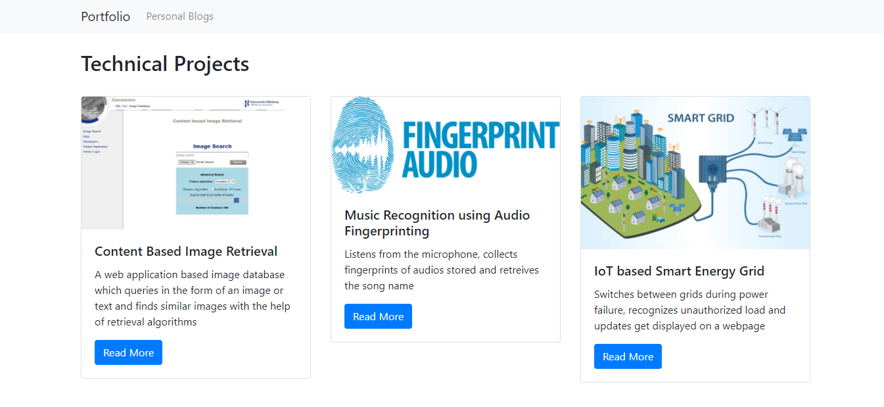
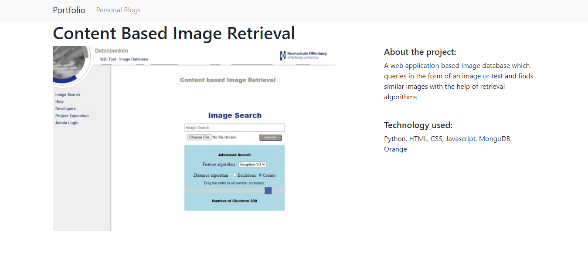
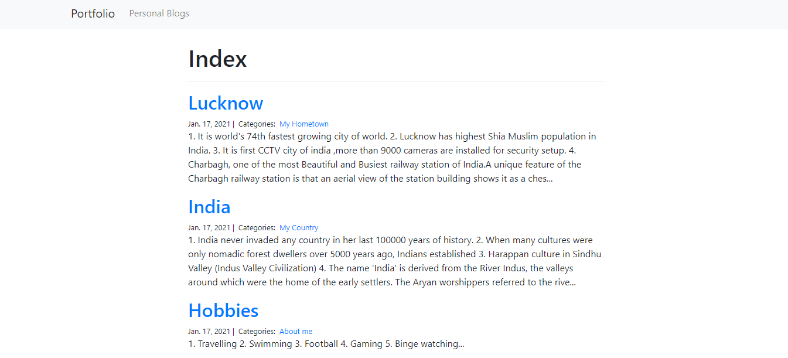
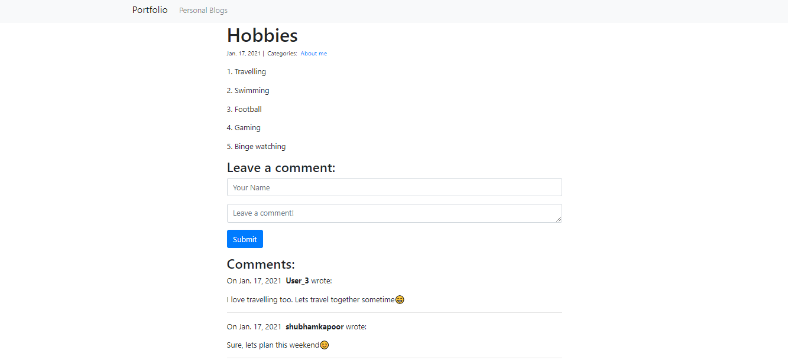
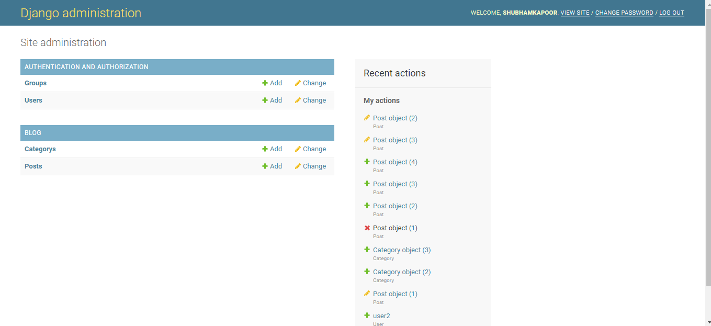

# My Portfolio
> It is a simple application about representation of my portfolio of projects in addition to a section where I as an administrator can write my blogs and users can comment on them.
## Table of contents
* [General info](#general-info)
* [Screenshots](#screenshots)
* [Technologies](#technologies)
* [Requirements](#requirements)
* [Setup](#setup)
* [Features](#features)
* [Status](#status)
* [Inspiration](#inspiration)
* [Contact](#contact)

## General info
The purpose of this project was for me to try out Djano for the first time as I have never used it before and I have been able to build this simple application in a small timeframe of 2 days. I found the experience to be fun and got to learn a lot of new things. I'm sure I would learn more as I dwell deeper into Django in the coming months.

## Screenshots

## Technologies
* Django
* Python
* Bootstrap
* SQLite
* HTML
* CSS

## Requirements
In your PC, have these requirements installed in order to run the application smoothly:
* python 2.7.x or 3.4.x
* django 3.1.x
* virtualenv

## Setup
* Download ZIP code file from github
* Extract the folders and files to a directory
* Open that directory in the file explorer
* Type 'cmd' in the windows navigation bar OR open a command window and use 'cd' to change directory to the folder where the files are extracted.
* In the command window type 'python manage.py runserver'
* Then in a browser open https://localhost:8000/projects or https://127.0.0.1:8000/projects or if its not working then see your command for the specific server link
* To post/edit/delete blogs, go to http://localhost:8000/admin/ or https://127.0.0.1:8000/admin
* Login with Username : shubhamkapoor
             Password : 12345678

## Features
* Showcase of my technical projects with two views, index and detail
* Ability for the superuser to post blogs with timestamp and pleasing view
* Any user can see and comment on the blogs

To-do list:
* Add a login feature for Users
* Only authorized users allowed to view and comment on blogs

## Status
Project is completed as of now. But maybe later improved with the to-do list features mentioned above.

## Inspiration
* https://www.djangoproject.com/start/
* https://realpython.com/django-setup/

## Contact
Created by [@kapoorshubham] - feel free to contact me!
